<div align="center">

<a href="https://soyrage.es/"></a>

<br/><br/>

# 🛡️ MailAegis — Open-Source Email Security & Phishing Analyzer

### The self-hosted mail client with an antivirus layer built in.

**Free. Open source. No account, no telemetry, no subscription.**

MailAegis connects to any corporate mailbox over **IMAP** — Microsoft 365, Google
Workspace, Mailcow, Zimbra, Proton — and reads it like a real mail client, while
scoring **every single message** for phishing, malware and **business email
compromise (BEC)**.

Six engines behind one verdict: **SPF/DKIM/DMARC** authentication, the **full
delivery path** (the IP it *really* came from), **VirusTotal** reputation,
**ClamAV** content scanning, **Hybrid Analysis** sandbox detonation, and an
in-house heuristic engine that understands *identity* and *intent*.

Run it as a **desktop app** (macOS · Windows), a **web app** on your own domain,
an **HTTP API**, or a **Postfix / SMTPS content filter** with proper exit codes.

<br/>

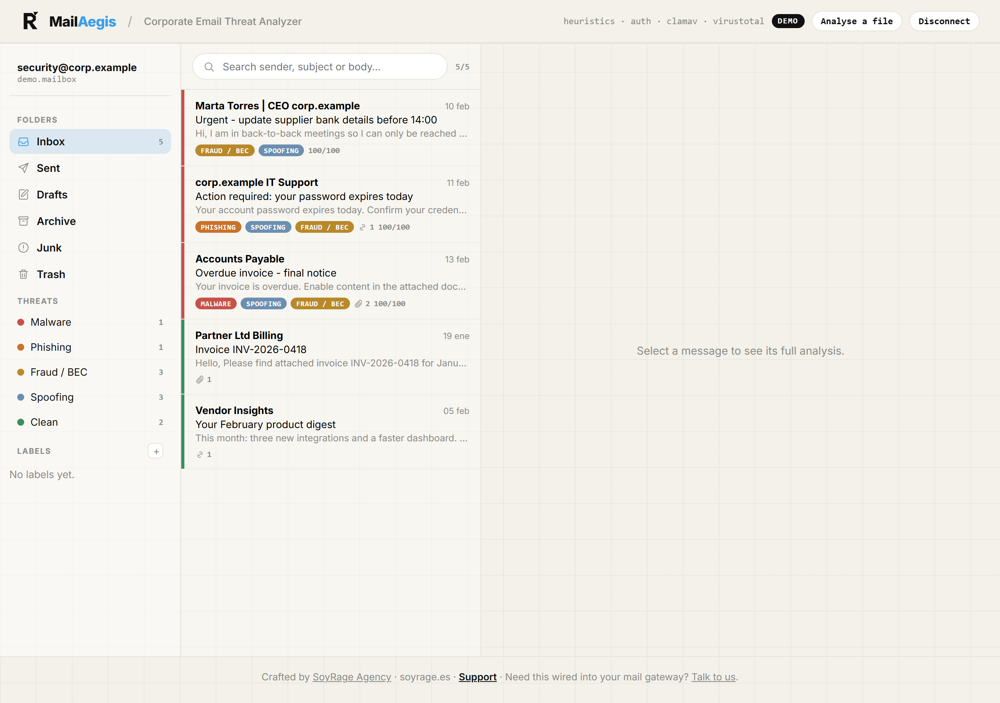

<sub>📬 Several mailboxes at once · **threat categories** · your own labels · a colour-coded verdict on every row. <a href="#-see-it">More screenshots ↓</a></sub>

<br/><br/>

[](https://github.com/soyrageagency/mailaegis/actions/workflows/ci.yml)
[](https://github.com/soyrageagency/mailaegis/releases)
[](https://nodejs.org)
[](https://www.typescriptlang.org/)
[](#-how-it-works)
[](./LICENSE)
[](https://www.paypal.com/paypalme/soyrageagency)

### Designed, built & maintained by **[SoyRage Agency](https://soyrage.es/)** · **https://soyrage.es/**

**⚡ New here? → [Quick start](#-quick-start).**  ·  **💻 [Desktop app for macOS & Windows](#-desktop-app-macos--windows)**  ·  **☕ [Support the project](https://www.paypal.com/paypalme/soyrageagency)**

</div>

---

## 📑 Table of contents

- [Why MailAegis](#-why-mailaegis)
- [Quick start](#-quick-start)
- [See it](#-see-it)
- [On a phone, too](#-on-a-phone-too)
- [Get it on your phone](#-two-ways-to-get-it-on-your-phone)
- [What it detects](#-what-it-detects)
- [The mail client](#-the-mail-client)
- [Sign in without an app password](#-sign-in-without-an-app-password-oauth-20)
- [How it works](#-how-it-works)
- [Desktop app (macOS & Windows)](#-desktop-app-macos--windows)
- [Integrate it](#-integrate-it)
- [Configuration](#-configuration)
- [Privacy & safety](#-privacy--safety)
- [Project structure](#-project-structure)
- [Development](#-development)
- [FAQ](#-faq)
- [More from the SoyRage suite](#-more-from-the-soyrage-suite)
- [Support the project](#-support-the-project)
- [Credits & License](#-credits--license)

---

## 💡 Why MailAegis

**Business email compromise is the most expensive cybercrime there is** — more
than ransomware, year after year — and it arrives as plain text with no
attachment, no link, and nothing for a signature engine to match on.

Corporate mail filters answer that with one bit: delivered, or quarantined. So
when a finance clerk asks *"is this invoice real?"*, nobody can tell them **why**
in under a minute. That minute is the whole attack.

MailAegis is built for that minute.

| | |
| --- | --- |
| 🧾 **It explains itself** | Every verdict is a list of findings with a severity, a plain-English reason and the evidence: *"the text says `portal.corp.example` but the link goes to `secure-corp-login.example`"*. |
| 🧠 **It understands intent, not just signatures** | Bank-detail changes, urgency, secrecy pressure, executive impersonation from a free mailbox — the BEC playbook, scored. |
| 🧭 **It shows the receipts** | The full `Received:` chain hop by hop, with the originating IP, its reverse DNS and its reputation. The answer to *"where did this actually come from?"* |
| 🔬 **Six opinions, one verdict** | Your own ClamAV, VirusTotal reputation, Hybrid Analysis sandbox behaviour, SPF/DKIM/DMARC, delivery-path forensics and the heuristic engine — and it tells you **which ones actually ran**. |
| 📬 **It reads like a mail client** | Several mailboxes, folders, Sent, search operators, threat categories, labels, keyboard shortcuts. Triage the way you actually work, not through a log file. |
| ✉️ **It scans what you send, too** | A compromised account mailing malware to your customers is the more expensive incident. Outbound is scanned before submission. |
| 🔗 **It drops into a pipeline** | `cat message.eml \| mailaegis scan` exits `0/1/2` for clean/suspicious/malicious — all Postfix, procmail or a milter needs. |
| 📦 **Zero runtime dependencies** | The MIME parser, IMAP client, SMTP client, ClamAV protocol and web server are hand-written on Node core. Nothing to audit but this repository. |

### Who it's for

- **IT teams without a SOC** who need to answer "is this real?" quickly and defensibly.
- **MSPs** triaging suspicious mail across many client mailboxes.
- **Security analysts** who want the delivery path, the IOCs and the `.eml`, not a dashboard.
- **Anyone self-hosting mail** — Mailcow, Zimbra, Postfix, Proton — who wants a scanner they control.

### How it compares

| | MailAegis | Secure email gateway | Thunderbird / Outlook |
| --- | :---: | :---: | :---: |
| Explains **why** a message is bad | ✅ finding-by-finding | ⚠️ a score, sometimes | ❌ |
| BEC / intent detection | ✅ | ✅ | ❌ |
| Delivery-path forensics | ✅ | ⚠️ raw headers | ⚠️ raw headers |
| A mail client you can work in | ✅ | ❌ | ✅ |
| Self-hosted, no data leaves | ✅ | ❌ | ✅ |
| Cost | **free & open source** | per seat, per month | free |

---

## ⚡ Quick start

**You need [Node.js ≥ 18](https://nodejs.org/).** Prefer a desktop app? → [download a build](#-desktop-app-macos--windows).

**macOS / Linux**
```bash
curl -fsSL https://raw.githubusercontent.com/soyrageagency/mailaegis/main/install.sh | bash
```

**Windows (PowerShell)**
```powershell
irm https://raw.githubusercontent.com/soyrageagency/mailaegis/main/install.ps1 | iex
```

Or by hand:

```bash
git clone https://github.com/soyrageagency/mailaegis.git && cd mailaegis
npm install && npm run build

node dist/index.js demo --demo     # analyse the built-in corpus, no keys needed
node dist/index.js serve --demo    # open http://127.0.0.1:4850
```

> 💡 **Everything works with no VirusTotal key and no ClamAV daemon.** In demo mode both scanners are simulated, so you can evaluate the whole product offline — that is exactly what CI runs.

```text
$ mailaegis demo --demo

  ✓ CLEAN      score   0/100  Legitimate supplier invoice
  ✓ CLEAN      score   0/100  Marketing newsletter
  ✓ MALICIOUS  score 100/100  CEO fraud / bank-detail change (BEC)
  ✓ MALICIOUS  score 100/100  Credential phishing from a look-alike domain
  ✓ MALICIOUS  score 100/100  Macro-enabled attachment carrying malware
```

---

## 🖼️ See it

<div align="center">

### One click to connect — Microsoft 365, Google Workspace, Mailcow and more
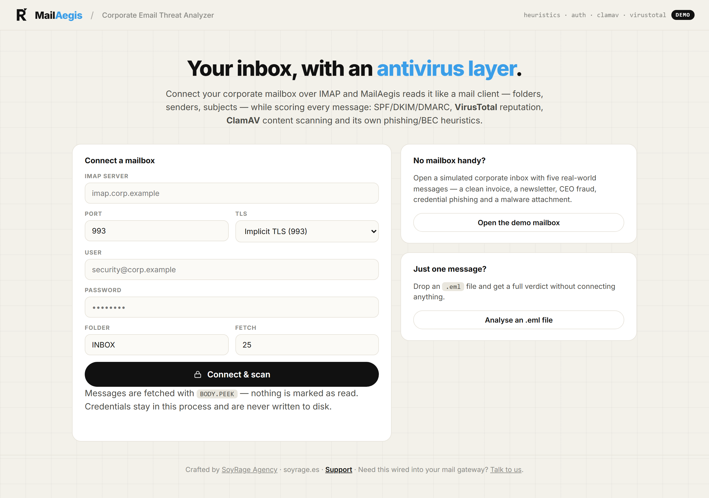

<sub>Presets fill in the hostname <b>and</b> warn you that Google and Microsoft reject your normal password over IMAP — the single most common failed connection.</sub>

### Why it's bad, finding by finding
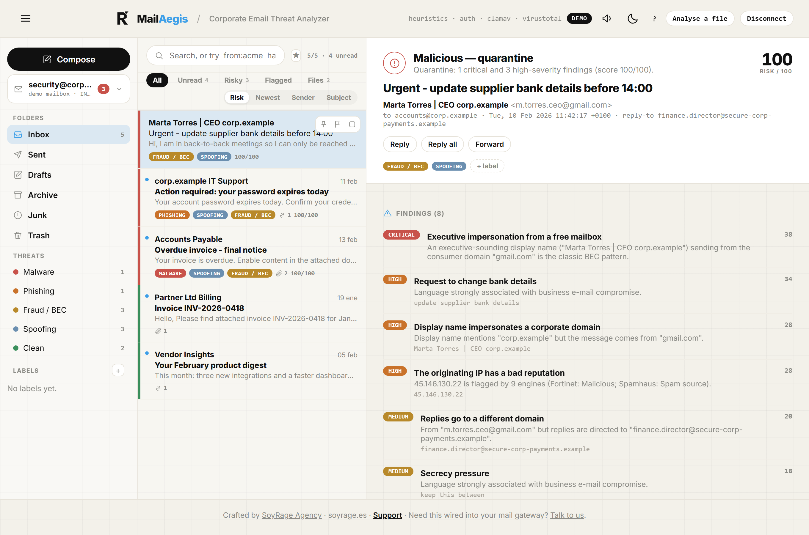

### The delivery path, the scanners, and which engines actually ran
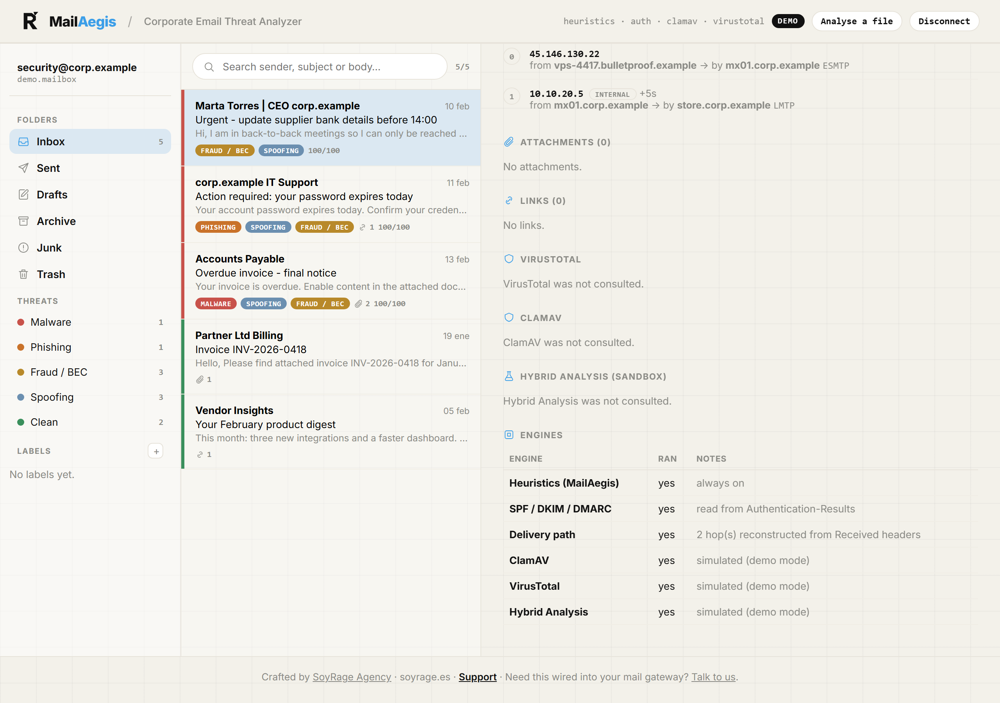

### Several mailboxes, one inbox
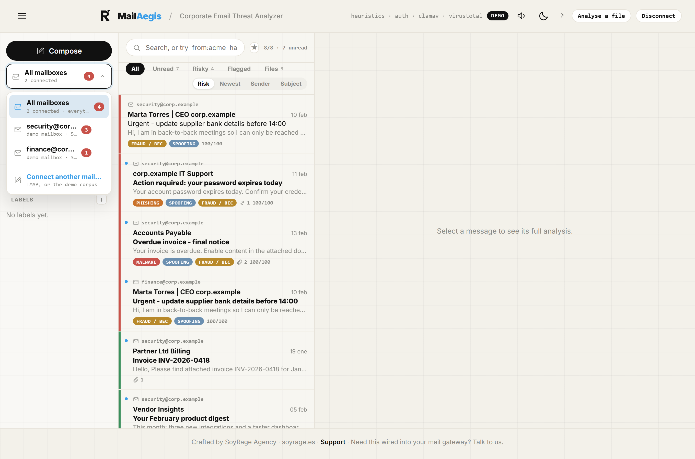

<sub>A company has <code>security@</code>, <code>finance@</code> and <code>info@</code>. Each keeps its own folders and counts — and you can see at a glance <b>which one is being attacked</b>.</sub>

### Search the way an analyst thinks
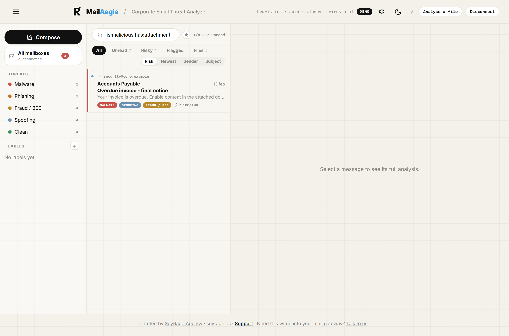

<sub><code>from:acme</code> · <code>has:attachment</code> · <code>is:malicious</code> · <code>is:unread</code> · <code>label:soc</code> · <code>score&gt;50</code> — and anything else is plain text.</sub>

### Reply safely — outbound is scanned too
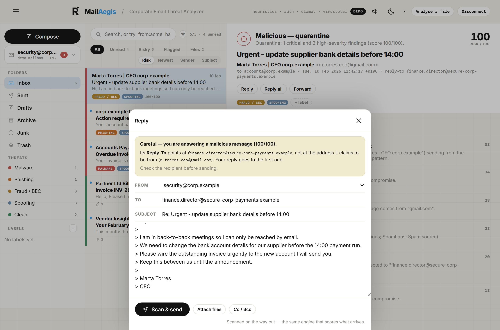

<sub>Answering a flagged message shows the verdict first — and if its <code>Reply-To</code> points somewhere other than its <code>From</code>, you see <b>both addresses</b>. That redirect is exactly how BEC succeeds.</sub>

### Dark mode
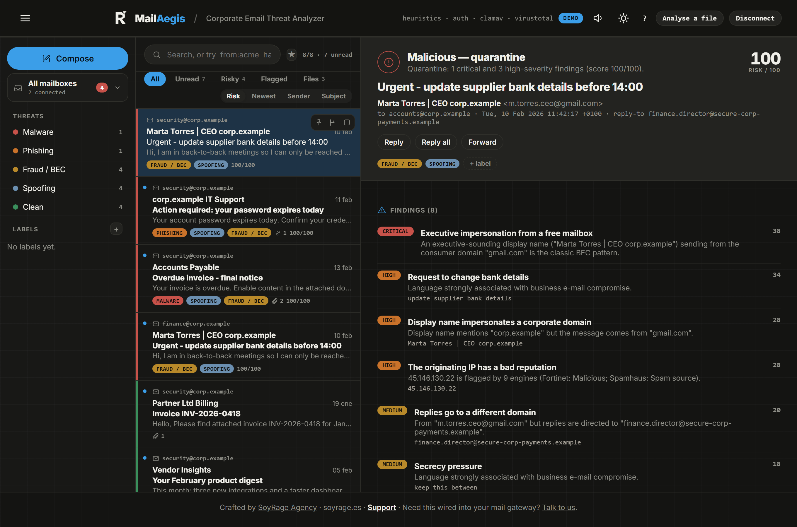

### A printable report for the ticket
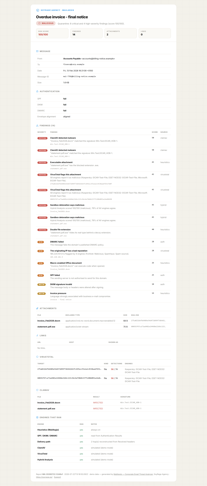

<br/>

## 📱 On a phone, too

The web UI is fully responsive — host it on your own domain and your team triages
from anywhere, no app store involved.

<table>
<tr>
<td width="25%">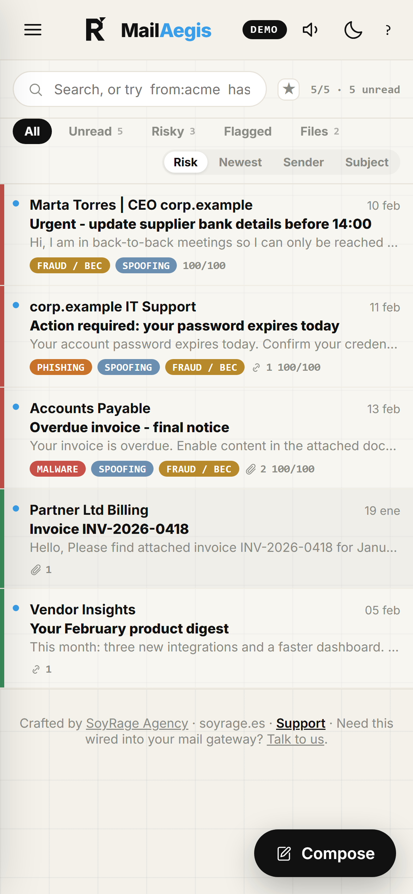</td>
<td width="25%">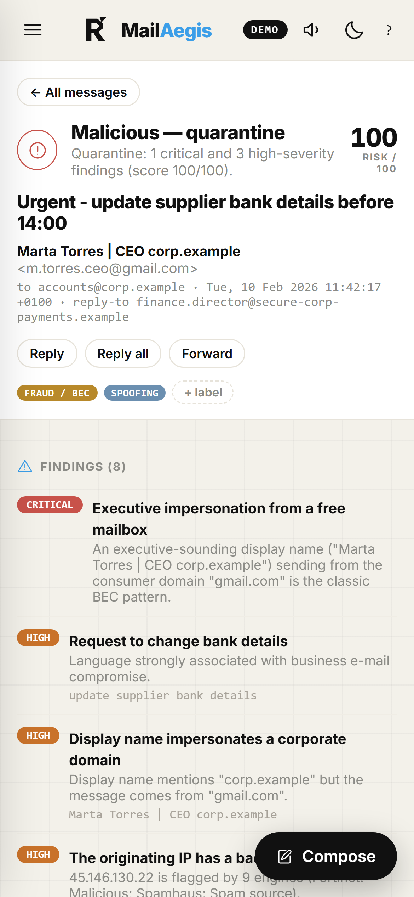</td>
<td width="25%">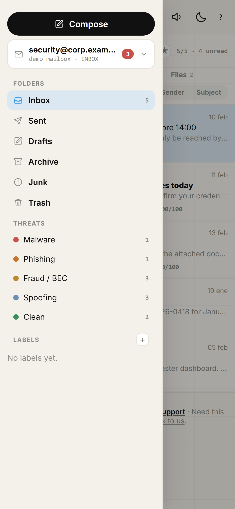</td>
<td width="25%">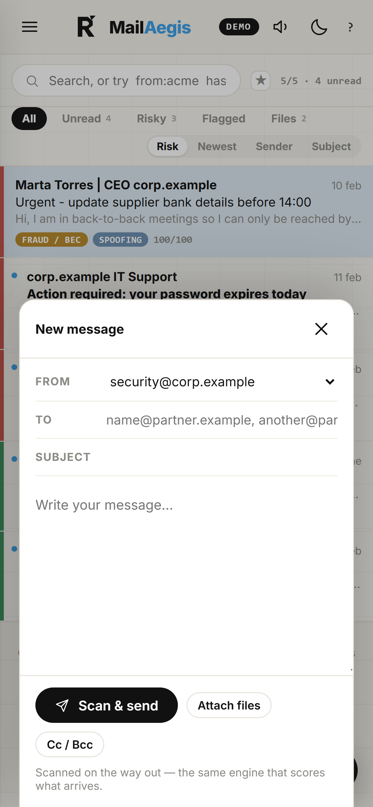</td>
</tr>
<tr>
<td align="center"><sub>Inbox</sub></td>
<td align="center"><sub>Analysis</sub></td>
<td align="center"><sub>Folders</sub></td>
<td align="center"><sub>Compose</sub></td>
</tr>
</table>

<sub>Every screenshot above is <b>demo mode</b>, unretouched — it is exactly what <code>npx mailaegis serve --demo</code> gives you. © SoyRage Agency · soyrage.es</sub>

</div>

### 📲 Two ways to get it on your phone

<table>
<tr>
<td width="58%" valign="top">

**1 · Add to home screen — no install needed**

MailAegis is a **PWA**. Open your hosted instance in Chrome or Safari and tap
*Add to Home Screen*. You get the app icon, full screen, no browser bar, and the
interface loads instantly even on a bad connection.

> The service worker caches the **interface only**. Message data is fetched
> fresh every time and never written to storage — a security tool that leaves
> someone's mail in a browser cache on a lost phone has created the problem it
> was bought to prevent.

**2 · Install the APK**

<a href="https://github.com/soyrageagency/mailaegis/releases/latest"></a>

1. Grab `MailAegis-*-android.apk` from the [latest release](https://github.com/soyrageagency/mailaegis/releases/latest).
2. Open it and allow **install from unknown sources** when Android asks.
3. Enter the address of your MailAegis — `https://mail.yourcompany.com` or a LAN
   address like `http://192.168.1.20:4850`. It remembers it.

**Why the app asks for an address.** MailAegis analyses mail in a Node process —
MIME parsing, ClamAV, IMAP, SMTP — and that does not run inside an APK. So the
Android app is a **client** for the server you already run. It talks to nothing
else; there is no MailAegis cloud to sign up for.

</td>
<td width="42%" valign="top" align="center">
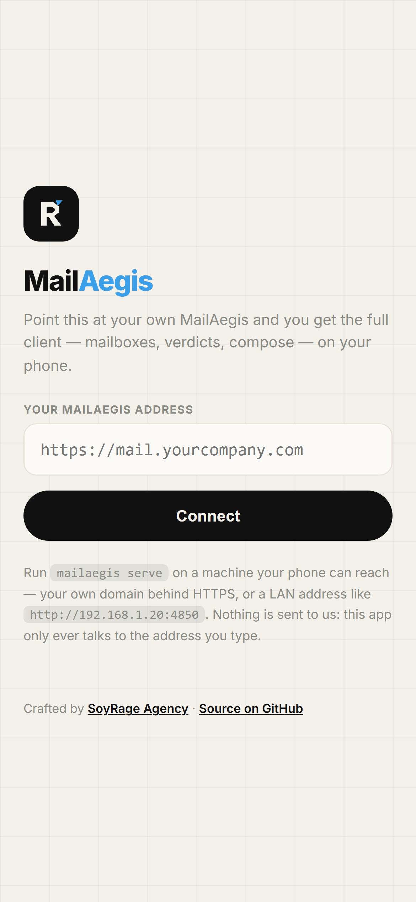
<br/><sub>The APK's first screen</sub>
</td>
</tr>
</table>

<div align="center">

</div>

---

## 🔍 What it detects

| Layer | Examples |
| --- | --- |
| 🪪 **Identity & BEC** | Executive impersonation from a free mailbox · display name embedding a different address or your brand · **look-alike domains** (`c0rp-example.com`, typo-squats) · replies redirected to another domain |
| 🎣 **Phishing** | Link text that doesn't match its destination · credential landing pages · bare-IP and punycode hosts · URL shorteners |
| 📎 **Attachments** | Executables and blocked extensions · **double extensions** (`statement.pdf.exe`) · macro-enabled Office files · **magic-byte/extension mismatch** · executables inside archives · password-protected archives |
| 🔐 **Authentication** | SPF fail/softfail · DKIM invalid · DMARC fail · envelope/From misalignment · spoofed *internal* senders |
| 🧠 **Intent** | Bank-detail change requests · urgent wire transfers · gift-card scams · account-expiry pressure · secrecy pressure |
| 🛰️ **Delivery path** | Reconstructs the full `Received:` chain — **the IP the message really came from**, its reverse DNS, every hop and dwell time · flags rDNS that contradicts the From domain, forged relay identities and single-hop injection · checks the **originating IP's reputation** |
| 🦠 **Scanners** | **ClamAV** signature hits · **VirusTotal** file, URL & IP detections · **Hybrid Analysis** sandbox detonation verdicts · files no engine has ever seen |

Each finding carries a weight; the total (capped at 100) is the risk score, and your thresholds turn it into **clean · suspicious · malicious**. Findings are also grouped into **threat categories** — Malware, Phishing, Fraud/BEC, Spoofing — so an analyst sees *what kind* of bad it is at a glance.

---

## 📬 The mail client

MailAegis is not a dashboard bolted onto a scanner — it is a mail client you can
work in all day, with the antivirus layer underneath every row.

**Mailboxes.** A company has `security@`, `finance@` and `info@`, so MailAegis
holds **several at once**. Each keeps its own folders, credentials and verdict
counts; *All mailboxes* is a unified inbox where every row says which account it
landed in. One-click presets for **Microsoft 365, Google Workspace, Mailcow,
Zoho, Zimbra, Fastmail, iCloud, IONOS, OVHcloud, Amazon WorkMail** and Proton
Bridge — with the app-password warning that saves the most common failed
connection.

**Writing.** Compose, reply, reply-all and forward with Cc/Bcc and attachments.
Two things a normal client does silently and this one refuses to:

- Replying to a flagged message **states the verdict and score** first.
- When the original's `Reply-To` points somewhere other than its `From`, the
  composer **shows you both addresses** — that redirect is exactly how business
  email compromise succeeds.

And everything you send is **scanned on the way out** by the same engine. A
malicious verdict holds the message back and lists why; only a second,
deliberate press sends it anyway.

**Working a queue.**

| | |
| --- | --- |
| 🔎 **Search operators** | `from:acme` · `subject:invoice` · `has:attachment` · `has:link` · `is:malicious` · `is:unread` · `is:pinned` · `label:soc` · `score>50` · `in:finance` — anything else is plain text |
| ⭐ **Saved searches** | Name a query once; it becomes a chip above the list |
| 📌 **Pin, flag, read/unread** | Pinned rows float above any sort order |
| ☑️ **Bulk actions** | Select many, then mark, pin, flag, label or export in one go |
| 🔃 **Sort & quick filters** | Risk · Newest · Sender · Subject, and one-tap Unread / Risky / Flagged / Files |
| ⌨️ **Keyboard** | `j k` move · `Enter` open · `c` compose · `r a f` reply/all/forward · `u p s x e` mark · `/` search · `?` the full list |
| 💾 **Export** | Download the original bytes as `.eml` — the source, headers and all |
| 🌙 **Dark mode** | One token block, inverted. Plus subtle sound cues you can silence |
| 🔔 **Announcements** | A card in the corner when there's a new release — driven by [one JSON file in this repo](channel/) |
| 🧾 **Raw source** | Headers, body or the lot, in a viewer — nobody should have to take the tool's word for a header |
| 📋 **Copy IOCs** | Hashes, URLs, hosts and the originating IP, **defanged** (`hxxps://`, `evil[.]example`) and ready to paste into a ticket |
| 🚫 **Block / allow senders** | Per address or per domain, with a note explaining why |
| ↩️ **Undo send** | Six seconds to catch the wrong recipient — the only moment a mistake is still cheap |
| ✍️ **Signatures & drafts** | One signature per mailbox; the composer autosaves and offers the draft back |
| 🔄 **Auto-refresh** | Every two minutes, with a cue that tells you whether what arrived is clean or not |
| 📜 **Audit trail** | Every decision recorded, and forwarded to your SIEM if you want it |

### 🔑 Sign in without an app password (OAuth 2.0)

Microsoft is switching basic authentication off tenant by tenant, and Google
only accepts an app password when the account has 2-Step Verification. Both are
workarounds. MailAegis speaks the sanctioned mechanism, **XOAUTH2**, for IMAP
*and* SMTP.

**Once**, register an application — [Entra ID](https://entra.microsoft.com/#view/Microsoft_AAD_RegisteredApps)
or the [Google Cloud console](https://console.cloud.google.com/apis/credentials) —
with a **desktop / mobile** redirect URI of `http://localhost`. Then:

```bash
OAUTH_PROVIDER=microsoft OAUTH_CLIENT_ID=<your client id> mailaegis oauth
```

Your browser opens, you sign in and consent, and MailAegis prints the lines to
paste into `.env`:

```env
OAUTH_PROVIDER=microsoft
OAUTH_CLIENT_ID=…
OAUTH_TENANT=contoso.onmicrosoft.com    # microsoft only
OAUTH_REFRESH_TOKEN=…
IMAP_HOST=outlook.office365.com
IMAP_USER=security@contoso.com          # no password needed
```

The flow is the loopback ("installed application") one, with **PKCE** — the
redirect lands on `127.0.0.1`, which any other local process could also listen
for on a different port, so a stolen authorization code is worthless without the
verifier.

The **refresh token is the credential**: keep it as you would a password. It
never leaves your machine except to the provider's own token endpoint. Access
tokens live in memory only and are re-fetched a minute before they expire, so a
token cannot die mid-fetch. If the provider rotates the refresh token, MailAegis
prints the new one rather than failing silently a month later.

### Audit trail & SIEM

Every decision worth defending later — a message quarantined, an outbound
message held back, a **send that overrode that refusal**, a sender added to a
list — is appended to `audit.jsonl` and, if you set `MAILAEGIS_WEBHOOK_URL`,
POSTed live to Splunk, Sentinel, Wazuh or an n8n flow.

```jsonc
{"at":"2026-07-22T14:02:11.318Z","action":"outbound.blocked","id":"MA-20260722-a1b2c3",
 "verdict":"malicious","score":100,"from":"ana@corp.example","to":["victim@partner.example"],
 "rules":["blocked-extension","double-extension"],"product":"MailAegis","version":"1.2.0"}
```

Three deliberate constraints:

- **It never blocks.** The write is one small line; the webhook is
  fire-and-forget with a short timeout and backs off after repeated failures. A
  SIEM that is down must not stop mail from being analysed.
- **It never carries message content.** Subjects, bodies and attachments stay
  out of it — rule *names* travel, the evidence they matched on does not. An
  audit trail is a record of decisions, not a second copy of everyone's mail
  sitting in a log directory with different permissions.
- **It is append-only and rotated by size**, so it cannot quietly fill a disk.

### About that allow list

The two halves are deliberately asymmetric, because they carry very different
risk.

**Blocking is unconditional.** A blocked sender is marked malicious no matter how
clean the message looks.

**Allowing is not.** An allow list that simply zeroes the score is the most
dangerous feature an email security tool can ship: the moment a supplier is on
it, spoofing that supplier becomes the cheapest way past every other engine —
and spoofing a `From` address costs nothing.

So an entry only takes effect when the message **also proves it is really from
that sender**: DMARC `pass`, or SPF *and* DKIM both passing and aligned. An
explicit DMARC failure is never overridden. An unauthenticated message from an
allow-listed address is scored exactly as if the list were empty, **and the
report tells you that is what happened**.

Even then, allowing only suppresses *heuristic* suspicion — tone, urgency,
look-alike scoring. A ClamAV hit, a VirusTotal detection or a sandbox verdict is
never waived: a trusted supplier with a compromised mailbox is a normal Tuesday.

Read and pinned state lives in **your browser, not on the IMAP server**.
Deliberately: MailAegis fetches with `BODY.PEEK`, so connecting it never changes
what your users see in Outlook. Writing `\Seen` back would break that promise the
first time an analyst opened a message.

---

## 🛠️ How it works

```
 parse → authenticate → trace → heuristics → ClamAV → VirusTotal → Hybrid → score
 (MIME)   (SPF/DKIM/DMARC)  (Received   (in-house)   (your      (file/URL/IP  (sandbox
                             chain, IP)              daemon)     reputation)   verdict)
```

Every report records **which engines actually ran**, so an "all clear" from a degraded pipeline can never be mistaken for a real one.

**Zero runtime dependencies** — the MIME parser, the IMAP client, the clamd INSTREAM protocol, the VirusTotal client and the HTTP server are all written directly on Node core.

---

## 💻 Desktop app (macOS & Windows)

MailAegis ships as a native-feeling desktop app so analysts don't need a terminal.

**[⬇️ Download the latest release](https://github.com/soyrageagency/mailaegis/releases/latest)** — `.dmg` for macOS (Intel + Apple Silicon) and `.exe` for Windows.

The desktop build starts the analyzer locally and opens the mail client in its own window — nothing is exposed to the network. Builds are produced by GitHub Actions on every tagged release; see [`.github/workflows/release.yml`](./.github/workflows/release.yml).

```bash
# Build it yourself
cd desktop && npm install && npm run dist
```

> The apps are **not code-signed** (no paid Apple/Microsoft certificates). macOS: right-click → Open the first time. Windows: "More info" → "Run anyway".

---

## 🔌 Integrate it

### 1. Command line (Postfix / procmail / any MTA)

```bash
cat message.eml | mailaegis scan          # exit 0 clean · 1 suspicious · 2 malicious · 3 error
mailaegis scan message.eml --json         # full analysis as JSON
mailaegis scan message.eml --report       # also write HTML + JSON + Markdown
```

A minimal Postfix `content_filter` wrapper:

```bash
#!/bin/sh
# /usr/local/bin/mailaegis-filter — invoked by Postfix with the message on stdin
tee /tmp/in.$$ | mailaegis scan >/dev/null 2>&1
case $? in
  2) exit 69 ;;                                   # malicious → bounce (EX_UNAVAILABLE)
  1) exec sendmail -i -X quarantine "$@" </tmp/in.$$ ;;   # suspicious → quarantine
  *) exec sendmail -i "$@" </tmp/in.$$ ;;         # clean → deliver
esac
```

### 2. HTTP API

```bash
mailaegis serve                      # http://127.0.0.1:4850
curl -s --data-binary @message.eml http://127.0.0.1:4850/api/analyze | jq .verdict
```

| Endpoint | Purpose |
| --- | --- |
| `POST /api/analyze` | Raw RFC-822 message in the body → JSON verdict |
| `GET /api/meta` | Which engines are active, and your thresholds |
| `POST /api/mailbox/connect` | Connect an IMAP mailbox (or `{"demo":true}`) |
| `GET /api/mailbox/messages` | The analysed message list |
| `GET /api/mailbox/messages/:id` | One full analysis |
| `POST /api/mailbox/select` | Switch folder (Inbox, Sent, …) |
| `GET/POST /api/categories` · `PUT …/labels` | Manage and assign labels |

Set `MAILAEGIS_API_TOKEN` to require `Authorization: Bearer …`.

### 3. Mail client UI

`mailaegis serve` (or the desktop app) gives you the three-pane client: folders, search, threat categories, labels and a full analysis per message.

---

## ⚙️ Configuration

All configuration is environment variables (a local `.env` is loaded automatically).

| Variable | Default | Purpose |
| --- | --- | --- |
| `MAILAEGIS_DEMO` | `false` | Simulate VirusTotal & ClamAV — no keys, no daemon. |
| `VIRUSTOTAL_API_KEY` | — | Enables the VirusTotal hash/URL lookups. |
| `VIRUSTOTAL_MALICIOUS_THRESHOLD` | `3` | Engines required before a detection counts as malicious. |
| `CLAMAV_HOST` / `CLAMAV_PORT` | — / `3310` | Your clamd daemon. |
| `HYBRID_ANALYSIS_API_KEY` | — | Enables Falcon Sandbox hash lookups. A free "restricted" key is enough. |
| `MAILAEGIS_CORPORATE_DOMAINS` | — | **Set this.** Your domains, for impersonation & look-alike detection. |
| `MAILAEGIS_BLOCKED_EXTENSIONS` | `exe,scr,js,vbs,…` | Attachment extensions treated as dangerous. |
| `MAILAEGIS_SUSPICIOUS_SCORE` / `_QUARANTINE_SCORE` | `35` / `70` | Verdict thresholds. |
| `IMAP_HOST` / `_PORT` / `_USER` / `_PASSWORD` / `_TLS` / `_MAILBOX` | — / `993` / … / `true` / `INBOX` | Pre-configure the mailbox so credentials never pass through the browser. |
| `MAILAEGIS_HOST` / `_PORT` | `127.0.0.1` / `4850` | API & UI bind address. |
| `MAILAEGIS_API_TOKEN` | — | Require a bearer token on the API. |
| `MAILAEGIS_OUT_DIR` | `./reports` | Where reports and labels are written. |
| `OAUTH_PROVIDER` | `microsoft` | `microsoft` or `google` — enables XOAUTH2 instead of a password. |
| `OAUTH_CLIENT_ID` / `OAUTH_CLIENT_SECRET` | — | From your own app registration. Desktop registrations usually have no secret. |
| `OAUTH_REFRESH_TOKEN` | — | Printed by `mailaegis oauth`. **This is the credential.** |
| `OAUTH_TENANT` | `common` | Microsoft only — your directory. |
| `MAILAEGIS_WEBHOOK_URL` | — | POST every audit event to your SIEM or automation flow (Splunk, Sentinel, Wazuh, n8n). |
| `MAILAEGIS_WEBHOOK_TOKEN` | — | Sent as `Authorization: Bearer …` with each POST. |
| `MAILAEGIS_AUDIT_MIN_VERDICT` | `suspicious` | Lowest verdict worth recording: `clean`, `suspicious` or `malicious`. |
| `MAILAEGIS_UPDATE_CHECK` | `true` | Poll the [announcement channel](channel/). `false` makes **no outbound request at all** — set it on air-gapped installs. |
| `MAILAEGIS_UPDATE_FEED` | GitHub raw | Point at your own JSON to broadcast to your own fleet. |
| `MAILAEGIS_UPDATE_TTL_MIN` | `360` | How long a fetched feed is cached. |

Run `mailaegis doctor` to see exactly which engines are live.

---

## 🔒 Privacy & safety

- **VirusTotal receives only SHA-256 hashes, URL identifiers and the originating IP** — never file contents, never message bodies.
- **Hybrid Analysis is only ever *searched by hash*** (`GET /search/hash`) — MailAegis never submits a file for detonation.
- **ClamAV runs on your own infrastructure**; attachment bytes never leave your network.
- **IMAP uses `BODY.PEEK`**, so connecting MailAegis never marks mail as read.
- **Credentials are never written to disk** and never returned by the API; they live in the process only while you are connected.
- The API **binds to `127.0.0.1`** by default.
- The bundled "malicious" samples carry the **EICAR test string** — never real malware.

---

## 🗂️ Project structure

```
mailaegis/
├── desktop/                    # Electron wrapper (macOS & Windows builds)
├── scripts/                    # copy-public · smoke · shots
└── src/
    ├── index.ts                # CLI: scan · demo · serve · menu · doctor
    ├── branding.ts · config.ts · logger.ts
    ├── core/
    │   ├── parse.ts            # Dependency-free MIME/RFC-822 parser
    │   ├── auth.ts             # SPF/DKIM/DMARC + alignment
    │   ├── engine.ts           # The in-house heuristic engine
    │   ├── trace.ts            # Received-chain forensics (origin IP, hops)
    │   ├── clamav.ts           # clamd INSTREAM client
    │   ├── virustotal.ts       # VirusTotal API v3 lookups
    │   ├── hybrid.ts           # Hybrid Analysis (Falcon Sandbox) v2
    │   ├── analyze.ts          # The pipeline + scoring
    │   ├── report.ts           # Console · HTML · Markdown · JSON
    │   ├── demo.ts             # Built-in corpus (EICAR-based)
    │   └── icons.ts · types.ts
    ├── mailbox/
    │   ├── imap.ts             # Minimal IMAP client (TLS)
    │   ├── session.ts          # Folders, messages, analyses
    │   └── categories.ts       # Threat classes + user labels
    ├── api/                    # HTTP API + the mail-client web UI
    └── menu/menu.ts
├── LICENSE · NOTICE · README.md
```

---

## 🧪 Development

```bash
npm run dev        # hot-reload with tsx
npm run typecheck  # strict type check
npm run build      # compile to dist/
npm run demo       # analyse the built-in corpus
npm run smoke      # 62-check end-to-end suite (what CI runs)
npm run fuzz       # robustness probe: malformed messages must never hang or throw
npm run shots      # regenerate the README screenshots
```

The smoke suite covers the MIME parser, every detection rule that matters, the delivery-path forensics, the CLI exit codes, the HTTP API, the mailbox/folder/label flows, and the **IMAP client against a real IMAP conversation** (a fake server is spun up in-process). `npm run fuzz` throws ~30 malformed/hostile messages at the parser and fails if any hangs, throws or backtracks.

---

## ❓ FAQ

<details>
<summary><b>Does MailAegis send my email anywhere?</b></summary>

No. Message bodies and attachment contents never leave your machine. VirusTotal
and Hybrid Analysis receive **only SHA-256 hashes**, URL identifiers and the
originating IP — never the file, never the text. ClamAV runs on your own daemon.
With no API keys configured, MailAegis makes no outbound request at all.
</details>

<details>
<summary><b>Will it mark my messages as read?</b></summary>

No. Everything is fetched with IMAP `BODY.PEEK`, which does not set the `\Seen`
flag. Connecting MailAegis never changes what your users see in Outlook — which
is also why read/pinned state is kept in the browser rather than written back.
</details>

<details>
<summary><b>Can it connect to Microsoft 365 / Gmail?</b></summary>

Yes, two ways.

**OAuth 2.0 (recommended).** Run `mailaegis oauth`, sign in in your browser, and
no password is involved at all. This is the only route into a tenant that has
basic authentication switched off — which Microsoft is doing progressively. See
[Sign in without an app password](#-sign-in-without-an-app-password-oauth-20).

**App password.** Still works where basic auth is enabled: Microsoft needs MFA on
the account, Google needs 2-Step Verification. Selecting either preset in the UI
links the vendor's own instructions.
</details>

<details>
<summary><b>Is this an anti-spam filter?</b></summary>

No — and deliberately. Spam filtering is a solved, high-volume problem your MX
already does. MailAegis is for the messages that **get through**: the invoice
that looks real, the CEO who is not the CEO. Use it alongside your gateway, not
instead of it.
</details>

<details>
<summary><b>Do I need VirusTotal or ClamAV keys to try it?</b></summary>

No. `npx mailaegis serve --demo` runs the whole thing with a realistic corpus
and simulated scanner verdicts. Every screenshot in this README is that demo.
</details>

<details>
<summary><b>Can I self-host it for my team?</b></summary>

Yes. `mailaegis serve` is a plain Node HTTP server with no database — put it
behind your reverse proxy, set `MAILAEGIS_API_TOKEN`, and the responsive UI works
on desktop and phone. Set `MAILAEGIS_UPDATE_CHECK=false` for air-gapped installs
and it makes no outbound request whatsoever.
</details>

<details>
<summary><b>What licence is it?</b></summary>

The **SoyRage Attribution License** — use it, fork it, deploy it commercially;
just keep the credit to [SoyRage Agency](https://soyrage.es/) intact. See
[LICENSE](./LICENSE).
</details>

---

## 🧰 More from the SoyRage suite

Same design, same care. **If one of these saves you time, a ⭐ genuinely helps.**

| Project | What it does | Star |
| --- | --- | --- |
| 🛡️ **[MailAegis](https://github.com/soyrageagency/mailaegis)** | *(you are here)* Corporate email threat analysis — VirusTotal, ClamAV and an in-house phishing/BEC engine, in a mail client. | [](https://github.com/soyrageagency/mailaegis) |
| 🗺️ **[NetAtlas](https://github.com/soyrageagency/netatlas)** | Living infrastructure documentation — agentless discovery that draws and maintains your network map. | [](https://github.com/soyrageagency/netatlas) |
| 🖧 **[Proxmox MCP Server](https://github.com/soyrageagency/proxmox-mcp-server)** | Chat with your Proxmox VE cluster; signed ISO 27001 / NIS2 / DORA resilience evidence. | [](https://github.com/soyrageagency/proxmox-mcp-server) |
| 🐳 **[Docker MCP Server](https://github.com/soyrageagency/docker-mcp-server)** | Chat with your Docker host — live web panel and a TUI with an AI copilot. | [](https://github.com/soyrageagency/docker-mcp-server) |
| 🚚 **[VMware → Proxmox (V2P)](https://github.com/soyrageagency/vmware-to-proxmox)** | Leaving vSphere? Inventory, compatibility, cost/time and a PDF assessment. | [](https://github.com/soyrageagency/vmware-to-proxmox) |

---

## 💙 Support the project

MailAegis is built and maintained in the open by **SoyRage Agency**. If it stops one invoice-fraud e-mail, it has already paid for itself — please consider supporting continued development.

<div align="center">

[](https://www.paypal.com/paypalme/soyrageagency)

**Need this wired into your corporate mail gateway?** [**SoyRage Agency**](https://soyrage.es/) does hands-on e-mail security engineering.

**paypal.me/soyrageagency** · a ⭐ on the repo helps too!

</div>

---

## 🖋️ Credits & License

<div align="center">

**Designed, built and maintained by [SoyRage Agency](https://soyrage.es/) — https://soyrage.es/**

Licensed under the **SoyRage Attribution License (SRAL)** — free to use, modify and distribute, provided the attribution to SoyRage Agency stays intact. See [LICENSE](./LICENSE).

MailAegis is a detection aid, not a guarantee. Always keep a second layer in your mail flow.

_Every message inspected — attachments, links, headers and intent._

</div>
